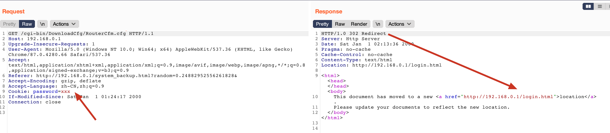
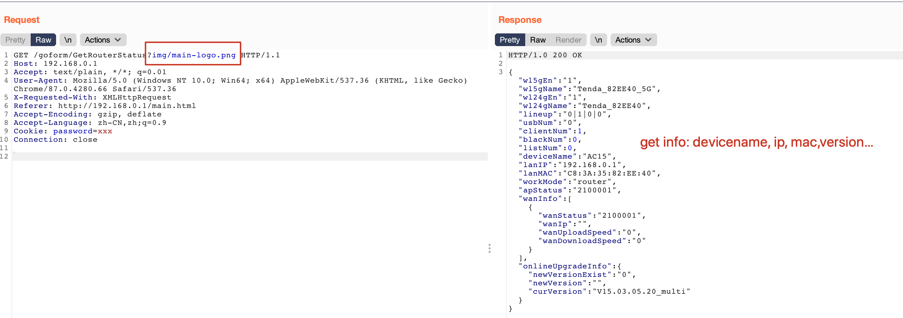
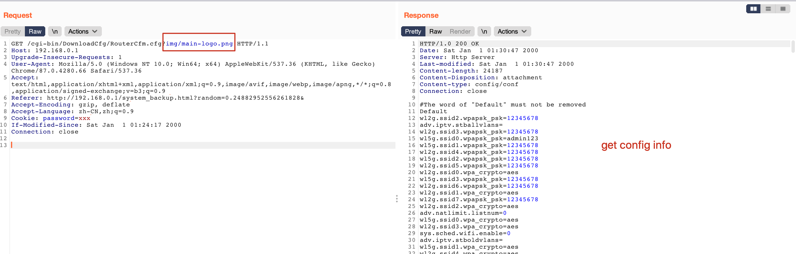

# CVE ID

- CVE-2021-44971

# Description

- Multiple Tenda devices are affected by authentication bypass, such as AC15V1.0 Firmware V15.03.05.20_multi、AC5V1.0 Firmware V15.03.06.48_multi and so on. an attacker can obtain sensitive information, and even combine it with authenticated command injection to implement RCE

# POC

> take "AC15V1.0 Firmware V15.03.05.20_multi" as an example

- if cookie is wrong, will return 302 and redirect to login.html

    

- while url include string "img/main-logo.png", will return to nomal——authentication bypass

    
    
    
